# 🎯 Bello — Next Generation Project Management

<div align="center">

<!-- TODO: Replace with actual screenshot -->
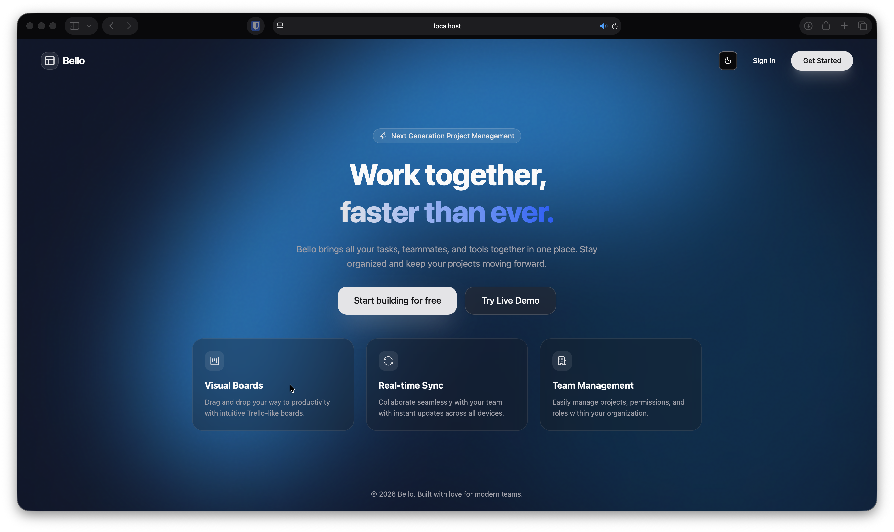

**A full-stack, real-time collaborative project management application inspired by Trello.**

Built with **React + TypeScript** on the frontend and **Bun + Elysia** on the backend.

[](https://react.dev)
[](https://elysiajs.com)
[-003B57?style=for-the-badge&logo=sqlite&logoColor=white)](https://turso.tech/libsql)
[](https://orm.drizzle.team)

🌐 **[Live Site](https://projectbello.hu)** · 🔗 **[Backend Repository](https://github.com/Halivagyok/Bello-Backend)**

</div>

---

## Table of Contents

- [Application Purpose](#-application-purpose)
- [Features & Menu Items](#-features--menu-items)
  - [Landing Page](#1-landing-page)
  - [Authentication](#2-authentication)
  - [Dashboard](#3-dashboard)
  - [Board View](#4-board-view)
  - [Card Details](#5-card-details)
  - [Project Management](#6-project-management)
  - [Calendar](#7-calendar--personal-tasks)
  - [User Profile & Settings](#8-user-profile--settings)
  - [Admin Panel](#9-admin-panel)
  - [Global Search](#10-global-search)
- [Responsive Design](#-responsive-design)
- [Data Storage & Database Structure](#-data-storage--database-structure)
- [Backend API Endpoints](#-backend-api-endpoints)
  - [Authentication Endpoints](#authentication-endpoints)
  - [Project Endpoints](#project-endpoints)
  - [Board Endpoints](#board-endpoints)
  - [Card Endpoints](#card-endpoints)
  - [List Endpoints](#list-endpoints)
  - [Personal Task Endpoints](#personal-task-endpoints)
  - [Label Endpoints](#label-endpoints)
  - [Image Endpoints](#image-endpoints)
  - [Admin Endpoints](#admin-endpoints)
  - [WebSocket API](#websocket-api)
- [Testing](#-testing)
  - [Frontend Tests](#frontend-tests)
  - [Backend Tests](#backend-tests)
- [Tech Stack Summary](#-tech-stack-summary)
- [Getting Started](#-getting-started)

---

## 📌 Application Purpose

**Bello** is a modern, full-featured project management web application designed for teams and individuals who need a visual, intuitive way to organize their work. It provides a Trello-like kanban board experience with additional features such as:

- **Real-time collaboration** via WebSocket — changes by one user are instantly reflected for all connected teammates
- **Hierarchical organization** — Projects contain Boards, Boards contain Lists, Lists contain Cards
- **Role-based access control** — Fine-grained permissions (Owner / Admin / Member / Viewer) at both the project and board level
- **Personal productivity tools** — Built-in personal calendar with recurring tasks and one-time events
- **Rich card details** — Cards support descriptions (Markdown), due dates (with multiple modes), image attachments, map locations (via Leaflet), labels, and member assignments
- **Team management** — Invite users via email, manage roles, and track activity through an admin dashboard
- **Modern UX** — Dark/light mode, animated 3D gradient backgrounds, drag-and-drop reordering, and responsive mobile-first design

The application targets small-to-medium teams, student groups, and individual power users who want a self-hosted alternative to commercial project management tools.

---

## 🧩 Features & Menu Items

### 1. Landing Page

The public-facing landing page introduces the application with an animated liquid gradient background (powered by Three.js + ShaderGradient), feature highlights, and call-to-action buttons. Visitors can try a live demo board without signing up.

<!-- TODO: Screenshot -->


**Key elements:**
- Animated 3D gradient background
- "Get Started" and "Try Live Demo" buttons
- Feature cards: Visual Boards, Real-time Sync, Team Management
- Dark/light mode toggle in the navigation

---

### 2. Authentication

The login page provides both **Sign In** and **Sign Up** forms, toggled via tab navigation. It includes a "Forgot Password" flow that sends a password reset email with a secure token.

<!-- TODO: Screenshot -->
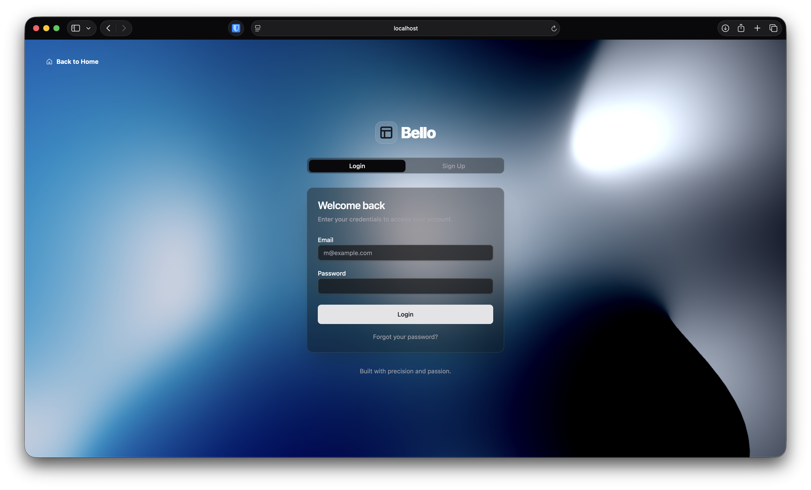
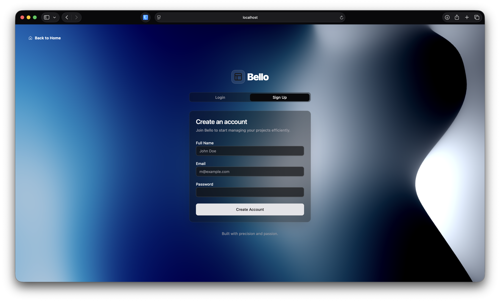

**Key elements:**
- Email + Password login with validation
- Sign up with name, email, and password (password requirements: 8+ chars, uppercase, lowercase, number)
- "Forgot Password" link → sends reset email via SMTP
- Password reset page with token-based verification
- Welcome email sent on successful registration

---

### 3. Dashboard

The main dashboard is the home page after authentication. It shows an overview of the user's workspace organized into clear sections.

<!-- TODO: Screenshot -->
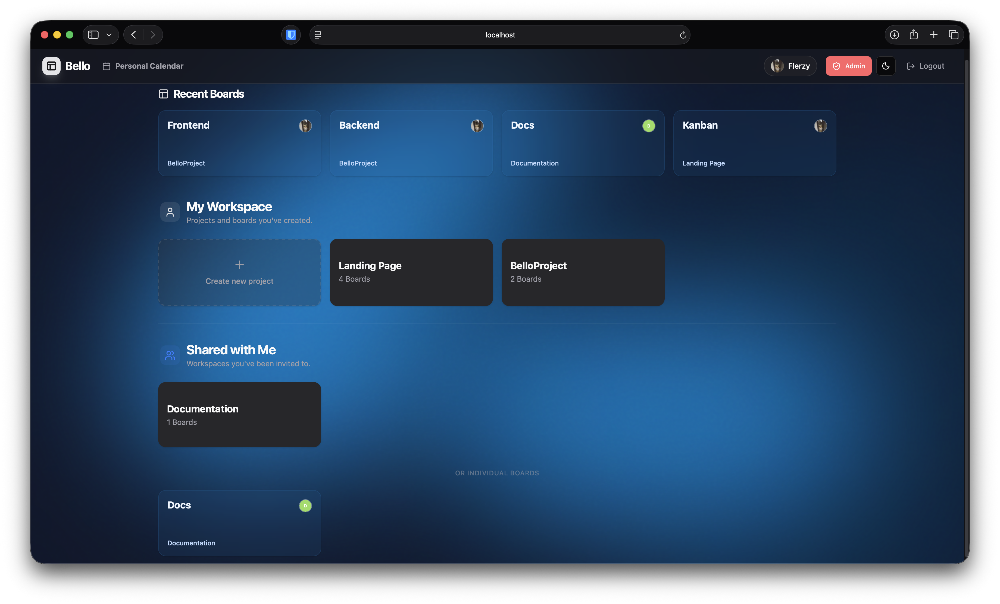

**Key elements:**
- **Recently Viewed Boards** — Quick access to the last 4 boards you visited
- **My Workspace** — Projects and standalone boards you own
  - Each project shows its boards as expandable cards
  - Create new projects with visibility settings (Private / Workspace / Public)
- **Shared with Me** — Projects and boards shared by other users
  - Shared Projects section
  - Individual Shared Boards section
- Create new boards with template selection (Empty, Kanban, Weekly Planner, Project Management, Brainstorming)

---

### 4. Board View

The core kanban board experience. This is where the actual task management happens with drag-and-drop functionality.

<!-- TODO: Screenshot -->
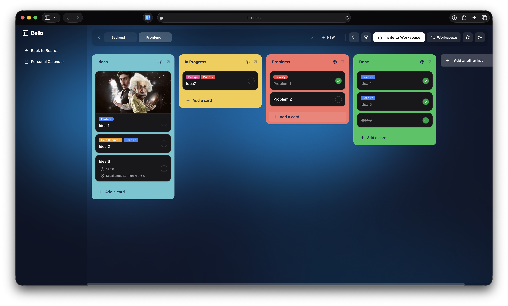

**Key elements:**
- **Lists** — Vertical columns containing cards, drag-and-drop reorderable
  - Add, rename, delete, and duplicate lists
  - Color-coded list headers
  - Sort cards by: Oldest, Newest, Alphabetical, Checked First, Checked Last
  - Move all cards to another list
  - Move entire list to another board
- **Cards** — Individual task items within lists
  - Quick add at the bottom of each list
  - Drag-and-drop between lists and within lists
  - Visual indicators for: due dates, labels, members, image attachments, descriptions, locations, completion status
  - Checkbox to mark cards as complete
- **Board Header** — Shows board title, member avatars, visibility badge
- **Board Filter System** — Filter cards by:
  - Text search (searches card titles and descriptions)
  - Due date range (Next 7 days, Next 14 days, Overdue, No due date)
  - Completion status (All, Completed, Not completed)
  - Labels (multi-select)
- **Board Visibility** — Private / Workspace / Public with inline toggle
- **Member Management** — View and manage board members, change roles

---

### 5. Card Details

Clicking a card opens a detailed dialog/modal with comprehensive editing capabilities.

<!-- TODO: Screenshot -->
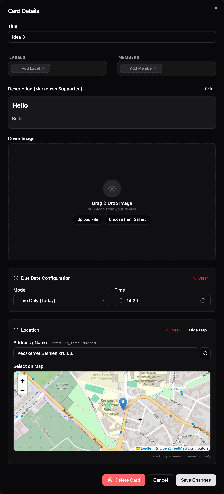

**Key elements:**
- **Title** — Editable inline
- **Description** — Markdown editor with preview toggle
- **Due Date** — Three modes:
  - Full (date + time)
  - Date only
  - Time only
  - Visual overdue indicator
- **Labels** — Assign colored labels from the project's label palette; create custom labels
- **Members** — Assign team members to the card from the board's member list
- **Image Attachment** — Attach images from the user's gallery or upload new ones
- **Location** — Set a geographic location with an interactive Leaflet map (click to pin, search support)
- **Move Card** — Move to a different list or a different board entirely
- **Delete Card** — Remove the card permanently
- **Completion** — Toggle the card's done/not-done status

---

### 6. Project Management

Projects act as containers that group related boards together, with shared membership and roles.

<!-- TODO: Screenshot -->
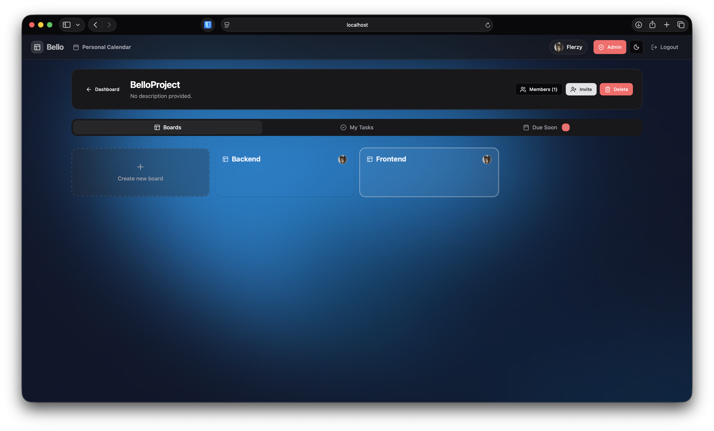

**Key elements:**
- **Project Overview** — Title, description, visibility setting
- **Board Tabs** — Paginated list of all boards within the project
- **Team Members** — View all members, their roles, invite new members by email
- **Role Hierarchy** — Owner → Admin → Member → Viewer
  - Owners and Admins can create boards, invite members, and change roles
  - Members can view and edit content
  - Viewers have read-only access
- **Project Labels** — Custom label palette shared across all boards in the project
  - Global labels (system-wide defaults) + project-specific labels
- **Project Cards View** — Aggregate view of all cards across all boards in the project
- **Delete Project** — Only the project owner can delete

---

### 7. Calendar & Personal Tasks

A personal productivity calendar for managing daily routines independently from boards.

<!-- TODO: Screenshot -->
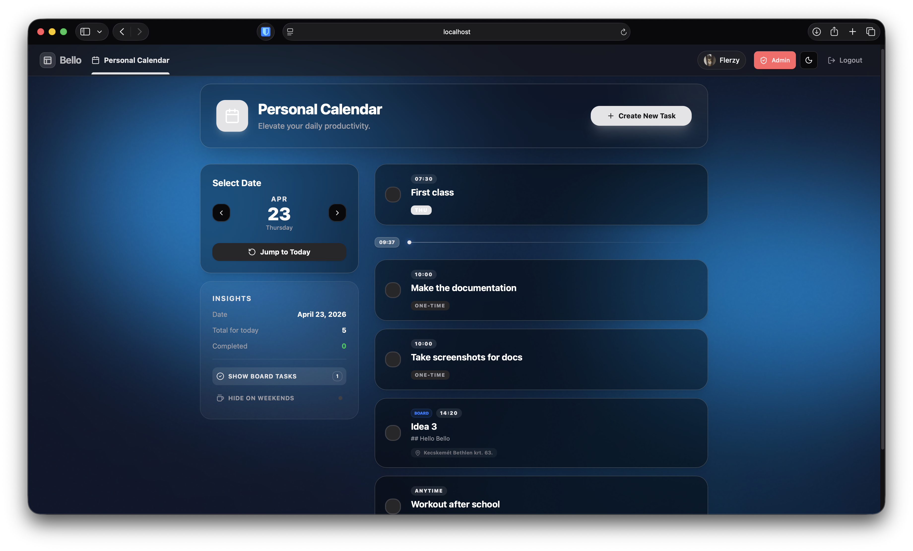

**Key elements:**
- **Day Navigation** — Browse day-by-day with previous/next arrows
- **Personal Tasks** — Create custom tasks with:
  - Title and description
  - Due time (HH:mm)
  - Repeat schedule (select days of the week) or one-time date
  - Location and image attachments
- **Board Tasks** — Automatically pulls cards with due dates from boards you're a member of
  - Option to hide board tasks on weekends
- **Task Completion** — Toggle tasks complete/incomplete per day (for recurring tasks, completion is tracked per date)
- **Empty State** — Friendly fallback when no tasks are scheduled

---

### 8. User Profile & Settings

The user settings page allows customization of the account and application appearance.

<!-- TODO: Screenshot -->
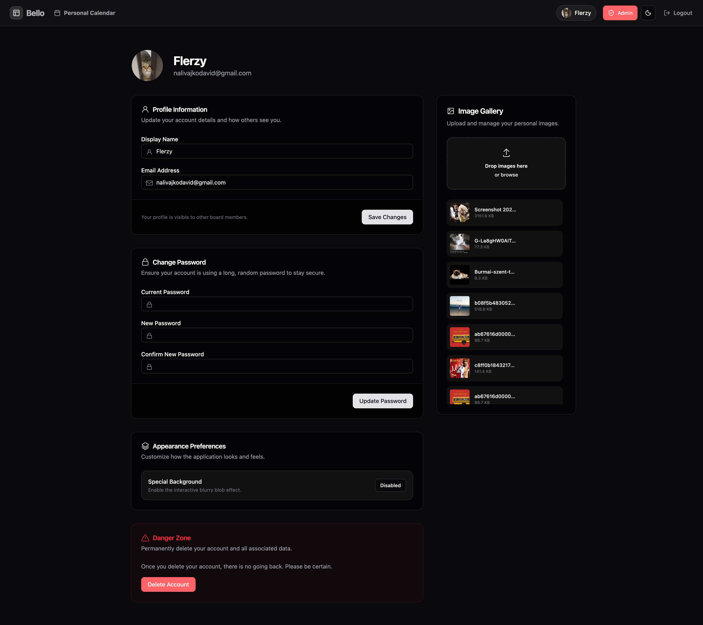

**Key elements:**
- **Profile Information** — Edit display name and email
- **Avatar** — Upload and crop a profile picture (with react-easy-crop)
- **Password** — Change password (requires current password)
- **Appearance Settings:**
  - Toggle animated 3D gradient background on/off
  - Customize gradient colors for light and dark mode (3 color palette each)
  - Toggle hiding board tasks on weekends in the calendar
- **Delete Account** — Permanently delete your account and all associated data
- **Logout** — End the current session

---

### 9. Admin Panel

A system administration dashboard available only to users with the `isAdmin` flag.

<!-- TODO: Screenshot -->
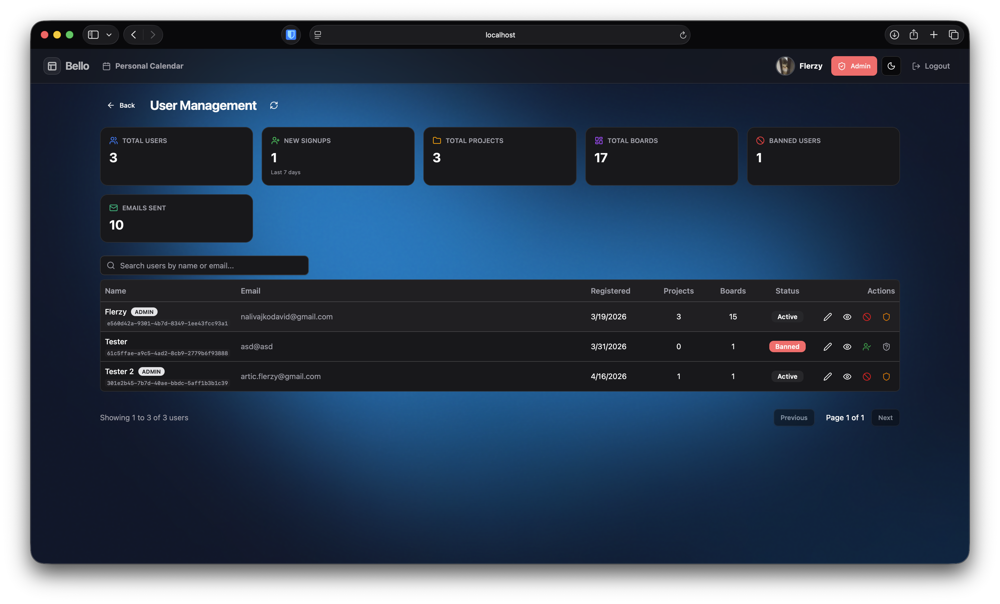

**Key elements:**
- **Dashboard Statistics:**
  - Total Users, Total Projects, Total Boards
  - Banned users count
  - Recent signups (last 7 days)
  - Total emails sent
- **User Management:**
  - View all registered users with their project/board counts
  - Ban/Unban users (prevents login and access)
  - Grant/Revoke admin privileges
  - Edit user display names
  - View user access details (which projects and boards they belong to)
  - Remove users from specific projects or boards

---

### 10. Global Search

A search component accessible from the top navigation bar, providing cross-board card search.

<!-- TODO: Screenshot -->
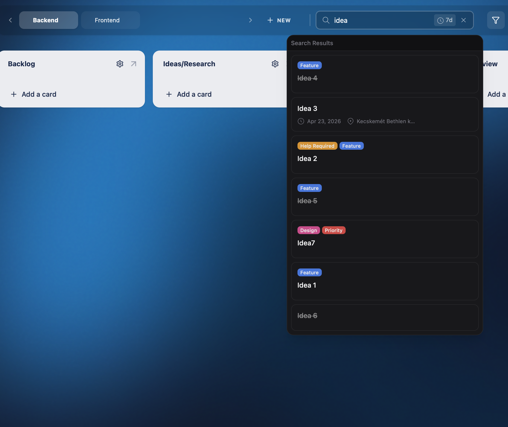

**Key elements:**
- Search by card title, description, or label name
- Filter for cards due soon (within 7 days)
- Results show matched cards with their board context
- Click a result to navigate directly to the card's board

---

## 📱 Responsive Design

Bello is designed with a **mobile-first responsive approach** using Tailwind CSS breakpoints. The layout adapts seamlessly between mobile, tablet, and desktop screen sizes.

### Key Responsive Differences

| Feature | Desktop | Mobile |
|---|---|---|
| **Navigation** | Horizontal top bar with full links | Collapsible hamburger menu |
| **Board View** | Lists side-by-side, horizontal scroll | Lists stack vertically or scroll horizontally with snap |
| **Card Details** | Side-by-side dialog with spacious layout | Full-screen modal |
| **Dashboard** | Multi-column grid layout | Single-column stacked layout |
| **Landing Page** | Full hero section with feature grid | Stacked layout, adjusted spacing |
| **Calendar** | Day view with sidebar | Full-width stacked view |
| **Admin Panel** | Table layout with action buttons | Compact card-based layout |

### Desktop View

<!-- TODO: Screenshot -->
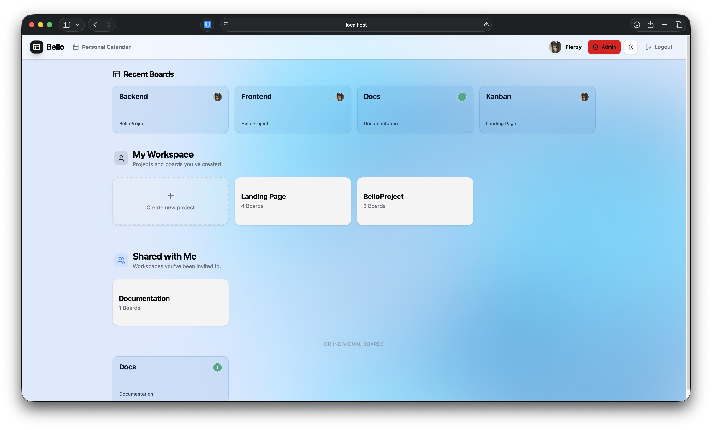

### Mobile Views

<!-- TODO: Screenshots -->
<table>
  <tr>
    <td align="center"><strong>Login</strong></td>
    <td align="center"><strong>Dashboard</strong></td>
    <td align="center"><strong>Board View</strong></td>
  </tr>
  <tr>
    <td>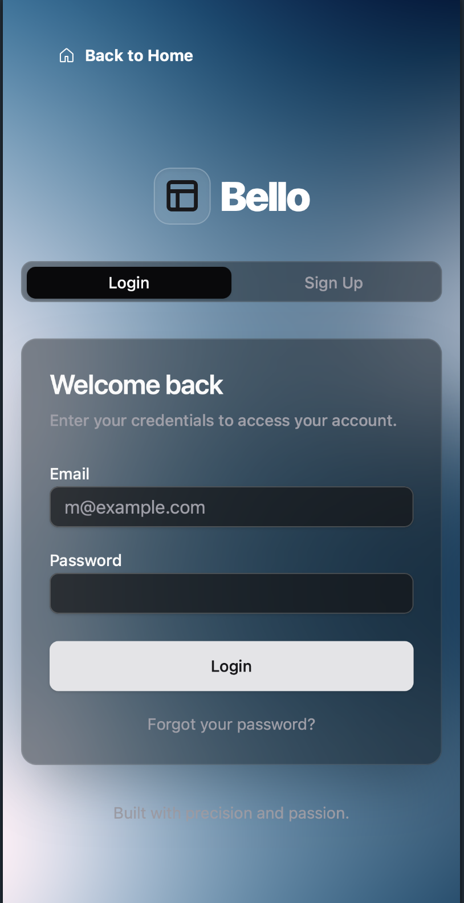</td>
    <td>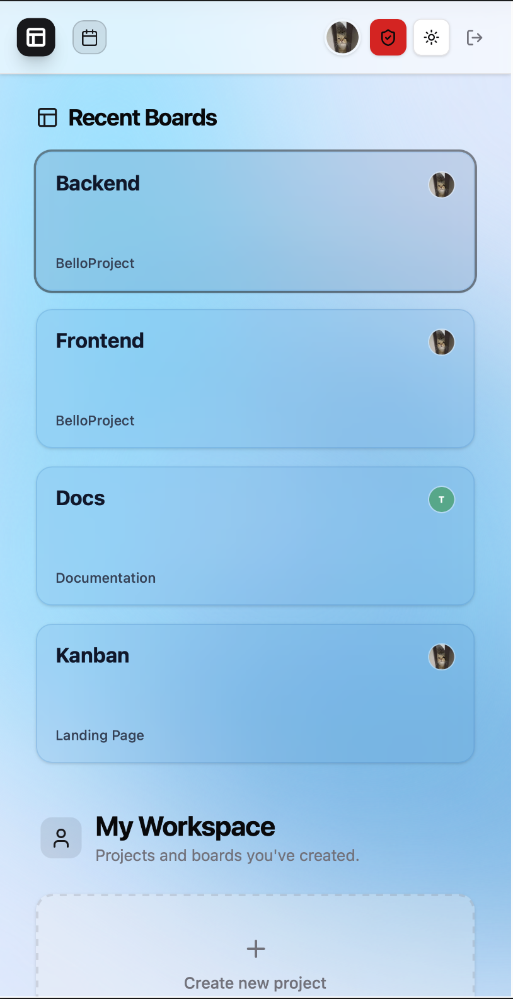</td>
    <td>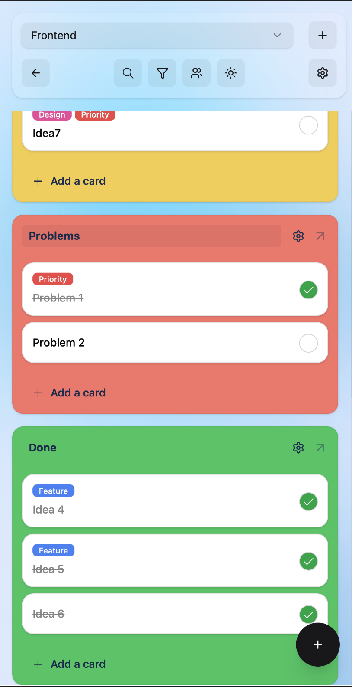</td>
  </tr>
</table>

---

## 💾 Data Storage & Database Structure

Bello uses **SQLite** (via [LibSQL/Turso](https://turso.tech/libsql)) as its database, managed through the **Drizzle ORM**. The database file (`bello.db`) is stored locally alongside the backend server. Migrations are handled by Drizzle Kit.

### Entity-Relationship Diagram
```
┌─────────────────────────────────────────────────────────────────────────────────────────┐
│                              BELLO DATABASE SCHEMA                                      │
└─────────────────────────────────────────────────────────────────────────────────────────┘

┌──────────────────────┐       ┌──────────────────────┐       ┌──────────────────────┐
│       users          │       │      sessions        │       │ password_reset_tokens│
├──────────────────────┤       ├──────────────────────┤       ├──────────────────────┤
│ PK id          TEXT  │──┐    │ PK id          TEXT  │       │ PK id          TEXT  │
│    email       TEXT  │  │    │ FK user_id     TEXT  │───┐   │ FK user_id     TEXT  │──┐
│    password    TEXT  │  │    │    expires_at   INT  │   │   │    token       TEXT  │  │
│    name        TEXT  │  │    └──────────────────────┘   │   │    expires_at   INT  │  │
│    avatar_url  TEXT  │  │                               │   │    created_at   INT  │  │
│    is_admin    INT   │  │                               │   └──────────────────────┘  │
│    is_banned   INT   │  │                               │                             │
│    preferences JSON  │  │        ┌──────────────────┐   │                             │
│    created_at  INT   │  │        │   email_stats    │   │                             │
└──────────────────────┘  │        ├──────────────────┤   │                             │
           │              │        │ PK id      TEXT  │   │                             │
           │              │        │    type    TEXT  │   │                             │
           │              │        │    recipient TEXT│   │                             │
           │              │        │    created_at INT│   │                             │
           │              │        └──────────────────┘   │                             │
           │              │                               │                             │
           │              │    ┌──────────────────────────┘─────────────────────────────┘
           │              │    │
           │              ▼    ▼
           │  ┌──────────────────────┐         ┌──────────────────────┐
           │  │      projects        │         │   project_members    │
           │  ├──────────────────────┤         ├──────────────────────┤
           │  │ PK id          TEXT  │◄────────│ FK project_id  TEXT  │
           │  │    title       TEXT  │         │ FK user_id     TEXT  │──► users
           │  │    description TEXT  │         │    role        TEXT  │
           │  │ FK owner_id    TEXT  │──► users│    (owner/admin/     │
           │  │    visibility  TEXT  │         │     member/viewer)   │
           │  │    board_ids   JSON  │         └──────────────────────┘
           │  │    created_at  INT   │
           │  └──────────────────────┘
           │              │
           │              │ (project_id FK, ON DELETE SET NULL)
           │              ▼
           │  ┌──────────────────────┐         ┌──────────────────────┐
           │  │       boards         │         │    board_members     │
           │  ├──────────────────────┤         ├──────────────────────┤
           │  │ PK id          TEXT  │◄────────│ FK board_id    TEXT  │
           │  │    title       TEXT  │         │ FK user_id     TEXT  │──► users
           │  │ FK owner_id    TEXT  │──► users│    role        TEXT  │
           │  │ FK project_id  TEXT  │         │    (owner/admin/     │
           │  │    visibility  TEXT  │         │     member/viewer)   │
           │  │    created_at  INT   │         └──────────────────────┘
           │  └──────────────────────┘
           │              │
           │              │ (board_id FK, ON DELETE CASCADE)
           │              ▼
           │  ┌──────────────────────┐
           │  │       lists          │
           │  ├──────────────────────┤
           │  │ PK id          TEXT  │
           │  │    title       TEXT  │
           │  │    position    REAL  │
           │  │ FK board_id    TEXT  │──► boards
           │  │ FK owner_id    TEXT  │──► users
           │  │    color       TEXT  │
           │  │    created_at  INT   │
           │  └──────────────────────┘
           │              │
           │              │ (list_id FK, ON DELETE CASCADE)
           │              ▼
           │  ┌──────────────────────┐    ┌──────────────────────┐    ┌──────────────────────┐
           │  │       cards          │    │    card_labels       │    │    card_members      │
           │  ├──────────────────────┤    ├──────────────────────┤    ├──────────────────────┤
           │  │ PK id          TEXT  │◄───│ FK card_id     TEXT  │    │ FK card_id     TEXT  │───► cards
           │  │    content     TEXT  │    │ FK label_id    TEXT  │─┐  │ FK user_id     TEXT  │──► users
           │  │    description TEXT  │    └──────────────────────┘ │  └──────────────────────┘
           │  │    due_date    INT   │                             │
           │  │    due_date_mode TEXT│    ┌──────────────────────┐ │
           │  │    image_url   TEXT  │    │       labels         │ │
           │  │    location    TEXT  │    ├──────────────────────┤ │
           │  │    location_lat REAL │    │ PK id          TEXT  │◄┘
           │  │    location_lng REAL │    │    title       TEXT  │
           │  │ FK list_id     TEXT  │    │    color       TEXT  │
           │  │    position    REAL  │    │ FK project_id  TEXT  │──► projects (nullable, global if NULL)
           │  │    completed   INT   │    │    created_at   INT  │
           │  │    due_date_set_at INT│   └──────────────────────┘
           │  │    created_at  INT   │
           │  └──────────────────────┘
           │
           │  ┌──────────────────────┐         ┌─────────────────────────────┐
           │  │   personal_tasks     │         │  personal_task_completions  │
           │  ├──────────────────────┤         ├─────────────────────────────┤
           │  │ PK id          TEXT  │◄────────│ FK task_id           TEXT   │
           │  │ FK user_id     TEXT  │──► users│ PK id                TEXT   │
           │  │    title       TEXT  │         │    completed_date    TEXT   │
           │  │    description TEXT  │         │    created_at        INT    │
           │  │    due_time    TEXT  │         └─────────────────────────────┘
           │  │    days_of_week TEXT │
           │  │    date        TEXT  │
           │  │    location    TEXT  │
           │  │    image_url   TEXT  │
           │  │    created_at  INT   │
           │  └──────────────────────┘
           │
           │  ┌──────────────────────┐
           │  │       images         │
           │  ├──────────────────────┤
           │  │ PK id          TEXT  │
           │  │ FK user_id     TEXT  │──► users
           │  │    filename    TEXT  │
           │  │    original_name TEXT│
           │  │    mime_type   TEXT  │
           │  │    size        INT   │
           │  │    created_at  INT   │
           └──└──────────────────────┘
```

### Table Descriptions

| Table | Purpose | Key Relationships |
|---|---|---|
| `users` | Stores all registered user accounts | Root entity — referenced by almost every other table |
| `sessions` | Active login sessions (cookie-based auth) | Belongs to `users` (cascade delete) |
| `password_reset_tokens` | Temporary tokens for password reset emails | Belongs to `users` (cascade delete) |
| `email_stats` | Tracks sent emails for admin analytics | Standalone logging table |
| `projects` | Containers that group boards together | Owned by a `users` entry |
| `project_members` | Many-to-many: users ↔ projects with roles | Links `users` and `projects` |
| `boards` | Individual kanban boards | Optionally belongs to a `projects`; owned by a `users` |
| `board_members` | Many-to-many: users ↔ boards with roles | Links `users` and `boards` |
| `lists` | Columns within a board | Belongs to `boards` (cascade delete) |
| `cards` | Individual task cards | Belongs to `lists` (cascade delete) |
| `labels` | Colored tags for categorizing cards | Optionally belongs to `projects` (global if NULL) |
| `card_labels` | Many-to-many: cards ↔ labels | Links `cards` and `labels` (both cascade delete) |
| `card_members` | Many-to-many: cards ↔ users (assigned members) | Links `cards` and `users` (both cascade delete) |
| `personal_tasks` | Personal calendar tasks (recurring or one-time) | Belongs to `users` (cascade delete) |
| `personal_task_completions` | Per-day completion records for personal tasks | Belongs to `personal_tasks` (cascade delete) |
| `images` | Uploaded image file metadata | Belongs to `users` (cascade delete) |
---

## 🔌 Backend API Endpoints

The backend is a **Bun + Elysia** HTTP server running on port `3000`. It uses cookie-based session authentication and provides a REST API with WebSocket support for real-time updates.

🔗 **[Backend Repository](https://github.com/Halivagyok/Bello-Backend)**

> **Note:** The backend includes built-in **Swagger documentation** at `/swagger` when running.

---

### Authentication Endpoints

All authentication endpoints are grouped under `/auth`.

#### `POST /auth/signup`

Creates a new user account and starts a session.

| Parameter | Type | Required | Description |
|---|---|---|---|
| `email` | string | ✅ | User's email address (must be unique) |
| `password` | string | ✅ | Must be ≥8 chars with uppercase, lowercase, and number |
| `name` | string | ❌ | Display name |

**Returns:** `{ user: { id, email, name, avatarUrl, isAdmin, preferences } }`

**Error Responses:**
| Status | Error | Condition |
|---|---|---|
| `400` | `"Email already exists"` | Duplicate email |
| `400` | `"Password must be at least 8 characters..."` | Password validation failed |

**Side Effects:** Sends a Welcome Email via SMTP, logs to `email_stats`.

---

#### `POST /auth/login`

Authenticates an existing user and creates a session.

| Parameter | Type | Required | Description |
|---|---|---|---|
| `email` | string | ✅ | Registered email |
| `password` | string | ✅ | Account password |

**Returns:** `{ user: { id, email, name, avatarUrl, isAdmin, preferences } }`

**Error Responses:**
| Status | Error | Condition |
|---|---|---|
| `400` | `"Invalid credentials"` | Wrong email or password |
| `403` | `"Your account has been banned."` | Account is banned by admin |

---

#### `POST /auth/logout`

Ends the current session and clears the session cookie.

**Returns:** `{ success: true }`

---

#### `GET /auth/me`

Returns the currently authenticated user based on the session cookie.

**Returns:** `{ user: { id, email, name, avatarUrl, isAdmin, preferences } }` or `{ user: null }` if not authenticated.

---

#### `PATCH /auth/me`

Updates the current user's profile information.

| Parameter | Type | Required | Description |
|---|---|---|---|
| `name` | string | ❌ | New display name |
| `email` | string | ❌ | New email address |
| `avatarUrl` | string \| null | ❌ | Avatar image URL |
| `preferences` | object | ❌ | UI preferences (background settings, calendar settings) |

**Returns:** `{ user: { ... } }`

---

#### `DELETE /auth/me`

Permanently deletes the current user's account and all associated data (cascading).

**Returns:** `{ success: true }`

---

#### `PATCH /auth/password`

Changes the current user's password.

| Parameter | Type | Required | Description |
|---|---|---|---|
| `currentPassword` | string | ✅ | Current password for verification |
| `newPassword` | string | ✅ | New password (must meet validation rules) |

**Returns:** `{ success: true }`

**Error Responses:**
| Status | Error | Condition |
|---|---|---|
| `400` | `"Incorrect current password"` | Verification failed |
| `400` | `"New password must be at least 8 characters..."` | Validation failed |

---

#### `POST /auth/forgot-password`

Sends a password reset email with a secure token (valid for 1 hour).

| Parameter | Type | Required | Description |
|---|---|---|---|
| `email` | string | ✅ | Account email address |

**Returns:** `{ success: true }` (always, to prevent email enumeration)

---

#### `POST /auth/reset-password`

Resets the password using a token from the reset email.

| Parameter | Type | Required | Description |
|---|---|---|---|
| `token` | string | ✅ | Reset token from email |
| `password` | string | ✅ | New password |

**Returns:** `{ success: true }`

**Error Responses:**
| Status | Error | Condition |
|---|---|---|
| `400` | `"Invalid or expired token"` | Token not found |
| `400` | `"Token has expired"` | Token older than 1 hour |

**Side Effects:** Invalidates all existing sessions and reset tokens for the user.

---

### Project Endpoints

All project endpoints are grouped under `/projects`. Requires authentication (except public project listing).

#### `GET /projects`

Returns all projects the current user has access to (owned or member).

**Returns:** `Project[]` — Array of project objects.

**Unauthenticated:** Returns only projects with `visibility: 'public'`.

---

#### `POST /projects`

Creates a new project.

| Parameter | Type | Required | Description |
|---|---|---|---|
| `title` | string | ✅ | Project name |
| `description` | string | ❌ | Project description |
| `visibility` | string | ❌ | `'private'` \| `'workspace'` \| `'public'` (default: `'workspace'`) |

**Returns:** The created project object. **Side Effects:** Creator is added as `'owner'` role member.

---

#### `GET /projects/:id`

Returns detailed project information including members list.

**Returns:** `{ ...project, members: [{ id, name, email, avatarUrl, role, isAdmin }] }`

**Error Responses:**
| Status | Error | Condition |
|---|---|---|
| `404` | `"Project not found"` | Invalid project ID |
| `403` | `"Forbidden"` | User is not a member and not admin |

---

#### `GET /projects/:id/cards`

Returns all cards across all boards within the project (aggregate view).

**Returns:** `Card[]` — Each card includes `labels` and `members` arrays plus `boardId`.

---

#### `PATCH /projects/:id`

Updates project settings (title, description, visibility, board ordering).

| Parameter | Type | Required | Description |
|---|---|---|---|
| `title` | string | ❌ | New project title |
| `description` | string | ❌ | New description |
| `visibility` | string | ❌ | New visibility setting |
| `boardIds` | string[] | ❌ | Reordered board ID list |

**Requires:** Owner or Admin role.

---

#### `POST /projects/:id/invite`

Invites a user to the project by email.

| Parameter | Type | Required | Description |
|---|---|---|---|
| `email` | string | ✅ | Email of the user to invite |
| `role` | string | ❌ | Role to assign (default: `'member'`) |

**Returns:** `{ success: true }`

**Error Responses:**
| Status | Error | Condition |
|---|---|---|
| `404` | `"User not found"` | No account with that email |
| `403` | `"Forbidden"` | Requester is not Owner or Admin |

**Side Effects:** Sends invite email via SMTP, broadcasts WebSocket updates.

---

#### `PATCH /projects/:id/members/:userId`

Changes a project member's role.

| Parameter | Type | Required | Description |
|---|---|---|---|
| `role` | string | ✅ | New role (`'owner'` \| `'admin'` \| `'member'` \| `'viewer'`) |

**Requires:** Requester must have higher role hierarchy than the target. Only owners can grant `'owner'` role.

---

#### `DELETE /projects/:id/members/:userId`

Removes a member from the project. Users can remove themselves (unless they are the primary owner).

---

#### `DELETE /projects/:id`

Deletes the entire project and all boards within it. **Requires:** Project owner or system admin.

---

#### `GET /projects/:id/labels`

Returns all labels for the project (global labels + project-specific labels).

---

#### `POST /projects/:id/labels`

Creates a new project-specific label.

| Parameter | Type | Required | Description |
|---|---|---|---|
| `title` | string | ✅ | Label name |
| `color` | string | ✅ | Hex color code (e.g. `#ef4444`) |

---

### Board Endpoints

All board endpoints are grouped under `/boards`. Most require authentication.

#### `GET /boards`

Returns all boards the user has access to.

**Unauthenticated:** Returns only boards with `visibility: 'public'`.

**Returns:** `Board[]` — Each board includes `ownerName` and `ownerAvatarUrl`.

---

#### `POST /boards`

Creates a new board.

| Parameter | Type | Required | Description |
|---|---|---|---|
| `title` | string | ✅ | Board name |
| `projectId` | string | ❌ | Assign to a project |
| `visibility` | string | ❌ | `'private'` \| `'workspace'` \| `'public'` (default: `'workspace'`) |
| `template` | string | ❌ | `'empty'` \| `'kanban'` \| `'weekly'` \| `'project'` \| `'brainstorming'` |

**Templates create the following default lists:**
| Template | Lists Created |
|---|---|
| `kanban` | To Do (red), In Progress (yellow), Done (green) |
| `weekly` | Monday, Tuesday, Wednesday, Thursday, Friday, Weekend |
| `project` | Backlog, Ideas/Research, In Progress, Review, Done (green) |
| `brainstorming` | Wild Ideas, Needs Details, Feasible, Discarded (red) |

**Returns:** The created board object. **Side Effects:** Creator is added as `'owner'` member.

---

#### `GET /boards/:id`

Returns detailed board data including all lists, cards, members, and role information.

**Returns:**
```json
{
  "id": "...",
  "title": "Board Name",
  "ownerId": "...",
  "projectId": "...",
  "visibility": "workspace",
  "role": "owner",
  "members": [{ "id": "...", "name": "...", "email": "...", "role": "admin" }],
  "lists": [
    {
      "id": "...",
      "title": "List Name",
      "position": 1000,
      "cards": [
        {
          "id": "...",
          "content": "Card Title",
          "labels": [{ "id": "...", "title": "Bug", "color": "#dc2626" }],
          "members": [{ "id": "...", "name": "User" }]
        }
      ]
    }
  ]
}
```

**Unauthenticated:** Only works for boards with `visibility: 'public'`.

---

#### `PATCH /boards/:id`

Updates board settings. **Requires:** Admin or Owner role.

| Parameter | Type | Required | Description |
|---|---|---|---|
| `title` | string | ❌ | New board title |
| `projectId` | string | ❌ | Move to a project |
| `visibility` | string | ❌ | New visibility setting |

---

#### `DELETE /boards/:id`

Deletes the board. **Requires:** Board owner or system admin.

---

#### `POST /boards/:id/lists`

Creates a new list on the board.

| Parameter | Type | Required | Description |
|---|---|---|---|
| `title` | string | ✅ | List title |
| `position` | number | ❌ | Position order (default: current timestamp) |
| `color` | string | ❌ | List header color |

**Requires:** Any role except Viewer.

---

#### `PATCH /boards/:id/members/:userId`

Changes a board member's role. Hierarchical role enforcement applies.

---

#### `DELETE /boards/:id/members/:userId`

Removes a member from the board.

---

### Card Endpoints

All card endpoints are grouped under `/cards`. Requires authentication.

#### `GET /cards/search`

Searches cards across all boards the user has access to.

| Query Param | Type | Description |
|---|---|---|
| `q` | string | Search text (matches title, description, label names) |
| `dueSoon` | string | `'true'` to filter cards due within 7 days or overdue |
| `date` | string | `YYYY-MM-DD` date filter for calendar view |

**Returns:** `Card[]` — Each card includes `labels`, `members`, and `boardId`.

---

#### `POST /cards`

Creates a new card in a list.

| Parameter | Type | Required | Description |
|---|---|---|---|
| `content` | string | ✅ | Card title/content |
| `listId` | string | ✅ | Target list ID |
| `position` | number | ❌ | Position within the list |
| `dueDate` | Date \| null | ❌ | Due date |
| `dueDateMode` | string \| null | ❌ | `'full'` \| `'date-only'` \| `'time-only'` |

**Requires:** Any role except Viewer.

---

#### `PATCH /cards/:id`

Updates a card's properties. Supports moving cards between lists (even across boards).

| Parameter | Type | Required | Description |
|---|---|---|---|
| `content` | string | ❌ | New title |
| `description` | string \| null | ❌ | Markdown description |
| `dueDate` | Date \| null | ❌ | Due date |
| `dueDateMode` | string \| null | ❌ | Date mode |
| `imageUrl` | string \| null | ❌ | Attached image URL |
| `location` | string \| null | ❌ | Location name |
| `locationLat` | number \| null | ❌ | Latitude coordinate |
| `locationLng` | number \| null | ❌ | Longitude coordinate |
| `listId` | string | ❌ | Move to different list |
| `position` | number | ❌ | New position |
| `completed` | boolean | ❌ | Completion status |

**Returns:** The updated card object.

**Permission Checks:** Validates write access on both source and target lists/boards.

---

#### `DELETE /cards/:id`

Deletes a card permanently. **Requires:** Any role except Viewer.

---

#### `POST /cards/:id/labels`

Assigns a label to a card.

| Parameter | Type | Required | Description |
|---|---|---|---|
| `labelId` | string | ✅ | Label ID to assign |

---

#### `DELETE /cards/:id/labels/:labelId`

Removes a label from a card.

---

#### `POST /cards/:id/members`

Assigns a user to a card.

| Parameter | Type | Required | Description |
|---|---|---|---|
| `userId` | string | ✅ | User ID to assign |

---

#### `DELETE /cards/:id/members/:userId`

Removes a user assignment from a card.

---

### List Endpoints

All list endpoints are grouped under `/lists`. Requires authentication.

#### `PATCH /lists/:id`

Updates list properties (title, position, color, or move to another board).

| Parameter | Type | Required | Description |
|---|---|---|---|
| `title` | string | ❌ | New list title |
| `position` | number | ❌ | New position |
| `color` | string | ❌ | Header color |
| `boardId` | string | ❌ | Move to different board |

---

#### `DELETE /lists/:id`

Deletes a list and all its cards (cascade).

---

#### `POST /lists/:id/duplicate`

Duplicates a list with all its cards.

| Parameter | Type | Required | Description |
|---|---|---|---|
| `title` | string | ❌ | Custom title for the copy (default: `"Copy of {original}"`) |

---

#### `POST /lists/:id/move-cards`

Moves all cards from one list to another.

| Parameter | Type | Required | Description |
|---|---|---|---|
| `targetListId` | string | ✅ | Destination list ID |

---

#### `POST /lists/:id/sort`

Sorts all cards within a list.

| Parameter | Type | Required | Description |
|---|---|---|---|
| `sortBy` | string | ✅ | `'oldest'` \| `'newest'` \| `'abc'` |

---

### Personal Task Endpoints

All personal task endpoints are grouped under `/personal-tasks`. Requires authentication.

#### `GET /personal-tasks?date=YYYY-MM-DD`

Returns personal tasks for the specified date (including recurring tasks matching the day of week).

**Returns:** `PersonalTask[]` — Each task includes a `completed` field for the specified date.

---

#### `POST /personal-tasks`

Creates a new personal task.

| Parameter | Type | Required | Description |
|---|---|---|---|
| `title` | string | ✅ | Task title |
| `description` | string \| null | ❌ | Task description |
| `dueTime` | string \| null | ❌ | Time in `HH:mm` format |
| `daysOfWeek` | string \| null | ❌ | Comma-separated days: `"0,1,2,3,4,5,6"` (0=Sunday) |
| `date` | string \| null | ❌ | One-time date in `YYYY-MM-DD` format |
| `location` | string \| null | ❌ | Location text |
| `imageUrl` | string \| null | ❌ | Attached image URL |

---

#### `PATCH /personal-tasks/:id`

Updates a personal task. Accepts the same fields as creation.

---

#### `DELETE /personal-tasks/:id`

Deletes a personal task.

---

#### `POST /personal-tasks/:id/toggle`

Toggles the completion status for a specific date.

| Parameter | Type | Required | Description |
|---|---|---|---|
| `date` | string | ❌ | Date to toggle (default: today) |

**Returns:** `{ completed: true/false }`

---

### Label Endpoints

Grouped under `/labels`. Requires authentication.

#### `PATCH /labels/:id`

Updates a label's title or color.

| Parameter | Type | Required | Description |
|---|---|---|---|
| `title` | string | ❌ | New label title |
| `color` | string | ❌ | New hex color |

**Note:** Global labels (no `projectId`) can only be modified by system admins.

---

#### `DELETE /labels/:id`

Deletes a label. Global labels require admin privileges.

---

### Image Endpoints

Grouped under `/images`. Requires authentication.

#### `GET /images`

Returns all images uploaded by the current user, ordered by newest first.

---

#### `POST /images`

Uploads a new image file.

| Parameter | Type | Required | Description |
|---|---|---|---|
| `file` | File | ✅ | Image file (multipart form data) |

**Returns:** `{ id, userId, filename, originalName, mimeType, size }`

Images are saved to the `uploads/` directory and served statically at `/uploads/{filename}`.

---

#### `DELETE /images/:id`

Deletes an image (removes both the database record and the file from disk).

---

### Admin Endpoints

Grouped under `/admin`. **Requires:** `isAdmin: true` on the authenticated user.

#### `GET /admin/users`

Returns all users with statistics.

**Returns:**
```json
{
  "users": [
    { "id": "...", "name": "...", "email": "...", "isAdmin": false, "isBanned": false, "createdAt": "...", "projectsCount": 2, "boardsCount": 5 }
  ],
  "stats": {
    "totalUsers": 42,
    "totalProjects": 15,
    "totalBoards": 67,
    "totalBanned": 1,
    "recentSignups": 3,
    "totalEmails": 120
  }
}
```

---

#### `GET /admin/users/:id/access`

Returns all projects and boards a specific user has access to.

---

#### `POST /admin/users/:id/ban`

Toggles ban status for a user. Cannot ban yourself.

---

#### `POST /admin/users/:id/admin`

Grants or revokes admin privileges.

| Parameter | Type | Required | Description |
|---|---|---|---|
| `isAdmin` | boolean | ✅ | New admin status |

---

#### `PATCH /admin/users/:id/name`

Updates a user's display name (admin override).

---

#### `DELETE /admin/users/:id/projects/:projectId`

Removes a user from a specific project.

---

#### `DELETE /admin/:id/boards/:boardId`

Removes a user from a specific board.

---

### WebSocket API

The WebSocket server runs at `ws(s)://host/ws` and provides real-time push updates.

#### Connection

```javascript
const ws = new WebSocket('ws://localhost:3000/ws');
```

#### Subscribe/Unsubscribe Messages

| Message | Description |
|---|---|
| `{ type: 'subscribe', boardId: '...' }` | Subscribe to board updates |
| `{ type: 'unsubscribe', boardId: '...' }` | Unsubscribe from board |
| `{ type: 'subscribe-project', projectId: '...' }` | Subscribe to project updates |
| `{ type: 'unsubscribe-project', projectId: '...' }` | Unsubscribe from project |
| `{ type: 'subscribe-user', userId: '...' }` | Subscribe to user-specific updates |
| `{ type: 'unsubscribe-user', userId: '...' }` | Unsubscribe from user updates |

#### Server Push Messages

| Message | Trigger |
|---|---|
| `{ type: 'update' }` | Any change to a board's lists, cards, or members |
| `{ type: 'project-update' }` | Any change to a project's settings, members, or boards |
| `{ type: 'user-update' }` | User removed from project/board, or admin action |

The client automatically re-fetches the relevant data when receiving these messages.

---

### Utility Endpoints

#### `GET /api/ping`

Health check endpoint. No authentication required.

**Returns:** `{ message: "Backend Connected! 🚀" }`

---

## 🧪 Testing

Both the frontend and backend have dedicated test suites built with **Vitest**.

### Frontend Tests

Frontend tests use **@testing-library/react** with **userEvent** for realistic user interaction simulation. Tests are located alongside their components in `src/pages/` and `src/components/`.

#### Test Files & Coverage

| Test File | Description | Tests |
|---|---|---|
| `LoginPage.test.tsx` | Login form rendering and interaction | 3 tests: render form, submit with valid inputs, toggle to signup |
| `AdminPage.test.tsx` | Admin dashboard rendering with mock data | 1 test: renders stats and user management |
| `CalendarPage.test.tsx` | Calendar navigation and task creation | 5 tests: render headers, prev/next day navigation, create dialog, empty state |
| `Card.test.tsx` | Card component rendering | 1 test: renders card content correctly |
| `CardDetailsDialog.test.tsx` | Card details dialog rendering | 1 test: renders dialog framework without crashing |
| `CardList.test.tsx` | CardList component with DnD context | 1 test: renders list title and "Add a card" button |

#### Running Frontend Tests

```bash
cd frontend
bun run vitest --run
```

<!-- TODO: Screenshot of test results -->
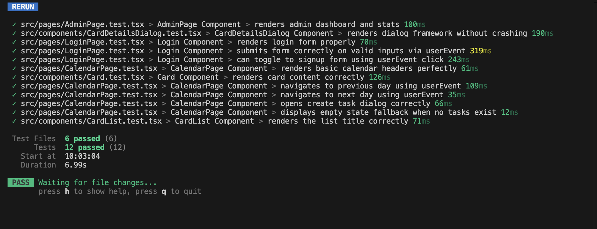

---

### Backend Tests

Backend tests directly invoke the Elysia app using `app.handle()` with mocked database layer. Tests are located in `backend/src/`.

#### Test Files & Coverage

| Test File | Description | Tests |
|---|---|---|
| `auth.test.ts` | Authentication flow testing | 2 tests: duplicate email rejection, successful signup |
| `boards.test.ts` | Board CRUD operations | 4 tests: create board, fetch board, update board, unauthorized delete |
| `cards.test.ts` | Card CRUD operations | 4 tests: create card, unauthorized create, update card, delete card |
| `projects.test.ts` | Project access control | 2 tests: unauthenticated access block, filtered project listing |

#### Running Backend Tests

```bash
cd backend
bun run vitest --run
```

<!-- TODO: Screenshot of test results -->
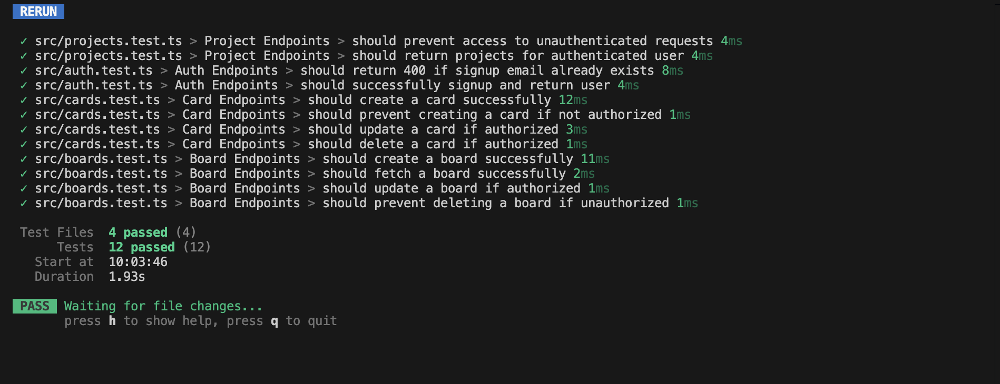

---

## 🛠 Tech Stack Summary

### Frontend

| Technology | Purpose |
|---|---|
| **React 19** | UI library |
| **TypeScript** | Type-safe JavaScript |
| **Vite 7** | Build tool and dev server |
| **Tailwind CSS 4** | Utility-first CSS framework |
| **Zustand** | Lightweight state management |
| **React Router DOM 7** | Client-side routing |
| **@hello-pangea/dnd** | Drag-and-drop (Trello-like reordering) |
| **Framer Motion** | Animations and transitions |
| **Radix UI** | Accessible, unstyled UI primitives (Dialog, Dropdown, Tabs, etc.) |
| **Lucide React + React Icons** | Icon libraries |
| **React Leaflet** | Interactive maps for card locations |
| **React Markdown** | Markdown rendering for card descriptions |
| **React Easy Crop** | Avatar image cropping |
| **Three.js + ShaderGradient** | 3D animated gradient backgrounds |
| **date-fns** | Date formatting and manipulation |
| **@elysiajs/eden** | Type-safe API client (end-to-end typesafety with Elysia) |
| **Vitest** | Testing framework |
| **@testing-library/react** | Component testing utilities |

### Backend

| Technology | Purpose |
|---|---|
| **Bun** | JavaScript runtime (fast, all-in-one) |
| **Elysia** | HTTP framework with built-in validation and WebSocket |
| **Drizzle ORM** | Type-safe SQL ORM |
| **SQLite (LibSQL)** | Embedded database |
| **Nodemailer** | SMTP email sending |
| **React Email** | Email template rendering |
| **@elysiajs/swagger** | Auto-generated API documentation |
| **@elysiajs/cors** | Cross-origin resource sharing |
| **@elysiajs/static** | Static file serving for uploads |
| **Vitest** | Testing framework |

---

## 🚀 Getting Started

### Prerequisites

- [Bun](https://bun.sh) (v1.0 or later)
- Node.js 18+ (for some dev tooling)

### Installation

```bash
# Clone the repositories
git clone https://github.com/Halivagyok/Bello.git frontend
git clone https://github.com/Halivagyok/Bello-Backend.git backend

# Install dependencies
cd backend && bun install
cd ../frontend && bun install
```

### Environment Setup

**Backend** (`backend/.env`):
```env
SMTP_HOST=your-smtp-host
SMTP_PORT=587
SMTP_USER=your-email@example.com
SMTP_PASS=your-password
FRONTEND_URL=http://localhost:5173
```

**Frontend** (`frontend/.env`):
```env
VITE_API_URL=http://localhost:3000
```

### Running Locally

```bash
# Terminal 1: Start backend
cd backend
bun run db:migrate    # Run database migrations
bun run dev           # Starts on http://localhost:3000

# Terminal 2: Start frontend
cd frontend
bun run dev           # Starts on http://localhost:5173
```

### Running Tests

```bash
# Frontend tests
cd frontend && bun run vitest --run

# Backend tests
cd backend && bun run vitest --run
```

---

**Built with ❤️ using modern web technologies.**

🔗 **[Backend Repository](https://github.com/Halivagyok/Bello-Backend)** · [Report Bug](https://github.com/Halivagyok/Bello/issues) · [Request Feature](https://github.com/Halivagyok/Bello/issues)

</div>
